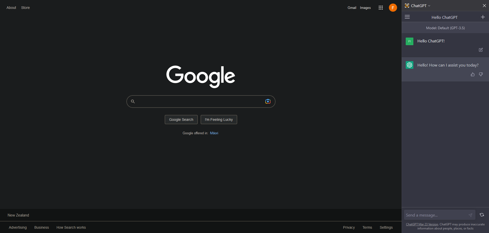

# ChatGPT Sidebar for Firefox

ChatGPT Sidebar is a Firefox extension that integrates the OpenAI's ChatGPT into a convenient sidebar, allowing users to interact with the AI directly within their browser.

## Features

- Easy-to-use ChatGPT integration directly in your browser
- Sidebar access for quick and convenient conversation with ChatGPT
- Works on any website`
- Minimal permission usage (only network access to `https://chat.openai.com/*`)

## Installation

1. Clone the repository or download the ZIP file and extract it.
2. In Firefox, navigate to `about:debugging#/runtime/this-firefox`.
3. Click on "Load Temporary Add-on...".
4. Browse to the folder where you extracted or cloned the repository, and select the `manifest.json` file.

**Note**: This extension is not available in the Firefox Add-ons store and must be loaded manually as a temporary add-on. The extension will be removed upon restarting Firefox.

## Usage

1. Open ChatGPT using the drop down at the top of your Firefox sidebar.
2. Type your message in the input area and press the "Send" button or hit `Enter`.
3. ChatGPT will respond to your message and display the response in the output area.

## Contributing

If you have suggestions for improving this extension or want to report a bug, please open an issue on GitHub or submit a pull request.

## License

This project is released under the [MIT License](LICENSE.txt).
